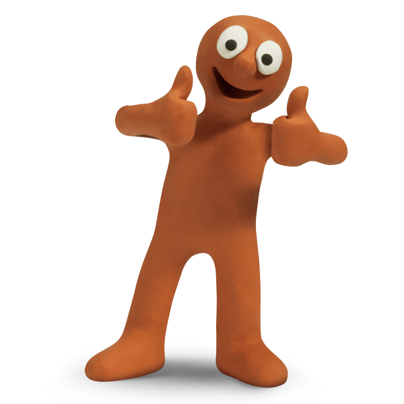
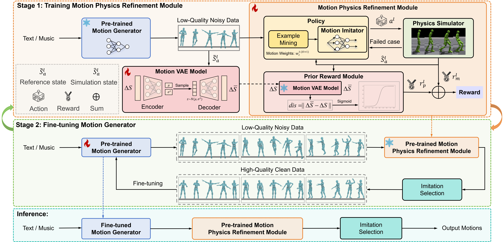

<div align="center">

<h1> Morph: A Motion-free Physics Optimization Framework for Human Motion Generation</h1>

<div>
    <strong>ICCV 2025</strong>
</div>

<div>
    <h4 align="center">
        <a href="https://arxiv.org/abs/2411.14951" target='_blank'>
            
        </a>
        <a href="https://interestingzhuo.github.io/Morph-Page/" target='_blank'>
            
        </a>
    </h4>
</div>

⭐ If Morph is helpful to your projects, please help star this repo. Thanks! 🤗

</div>

<be>

<div align="center">

</div>

This repository contains the official implementation of **Morph**. Morph is a Motion-free physics optimization framework, comprising a Motion Generator and a Motion Physics Refinement module, for enhancing physical plausibility without relying on costly real-world motion data.

## 🔧 Dependencies and Installation


Download Isaac Gym from the [website](https://developer.nvidia.com/isaac-gym), then
follow the installation instructions.

Once Isaac Gym is installed, install the external dependencies for this repo:

```
pip install -r requirements.txt
```


## ⚡ Training

First, an Morph model can be trained to imitate a dataset of motions clips using the following command:
```
horovodrun -np 8 python ase/run.py --task HumanoidLocationSMPL --cfg_env ase/data/cfg/humanoid_smpl_location.yaml --cfg_train ase/data/cfg/train/rlg/smpl_humanoid_task.yaml --motion_file ase/data/motions/WalkDog.npy --headless
```
`--motion_file` can be used to specify a dataset of motion clips that the model should imitate. 
The task `HumanoidLocationSMPL` will train a model to imitate a dataset of motion clips.
Over the course of training, the latest checkpoint `Humanoid.pth` will be regularly saved to `output/`,
along with a Tensorboard log. `--headless` is used to disable visualizations. If you want to view the
simulation, simply remove this flag. 

## ✈️  Inference

To test a trained model, use the following command:
```shell
python ase/run.py --test --task HumanoidLocationSMPL --num_envs 1 --cfg_env ase/data/cfg/humanoid_smpl.yaml --cfg_train ase/data/cfg/train/rlg/smpl_humanoid_task.yaml --motion_file ase/data/motions/WalkDog.npy --checkpoint output/Humanoid_19-02-01-38/nn/Humanoid.pth
```


## 🏂 Motion Data

Motion clips are located in `ase/data/motions/`. Individual motion clips are stored as `.npy` files.  Motion clips can be visualized with the following command:
```
python ase/run.py --test --task HumanoidViewMotion --num_envs 2 --cfg_env ase/data/cfg/humanoid_smpl.yaml --cfg_train ase/data/cfg/train/rlg/smpl_humanoid_task.yaml --motion_file ase/data/motions/WalkDog.npy
```
`--motion_file` can be used to visualize a single motion clip `.npy`

If you want to load new motion clips to the character, you can take a look at an example script in `ase/poselib/load_motion.py`.


## 🚀 Visualization

If you want to visualize the motion as .fbx, you can take a look at an example script in `SMPL-to-FBX/Convert.py`.


## 🪪 License

The provided code and pre-trained weights are licensed under the [Apache 2.0 license](LICENSE).

## 🤗 Acknowledgement

This code is based on [ASE](https://github.com/nv-tlabs/ASE/tree/main). Some code are brought from [EDGE](https://github.com/Stanford-TML/EDGE). We thank the authors for their awesome work.

## 📧 Contact
If you have any questions, please feel free to reach me out at interesting_zhuo@163.com. 

## 📖 Citation
If you find our work useful for your research, please consider citing our paper:
```
@article{li2024morph,
  title={Morph: A Motion-free Physics Optimization Framework for Human Motion Generation},
  author={Li, Zhuo and Luo, Mingshuang and Hou, Ruibing and Zhao, Xin and Liu, Hao and Chang, Hong and Liu, Zimo and Li, Chen},
  journal={arXiv preprint arXiv:2411.14951},
  year={2024}
}
```


Also consider citing these prior works that are used in this project:
```
@article{luo2024m,
  title={M $\^{} 3$ GPT: An Advanced Multimodal, Multitask Framework for Motion Comprehension and Generation},
  author={Luo, Mingshuang and Hou, Ruibing and Li, Zhuo and Chang, Hong and Liu, Zimo and Wang, Yaowei and Shan, Shiguang},
  journal={Advances in Neural Information Processing Systems},
  volume={37},
  pages={28051--28077},
  year={2024}
}
```
