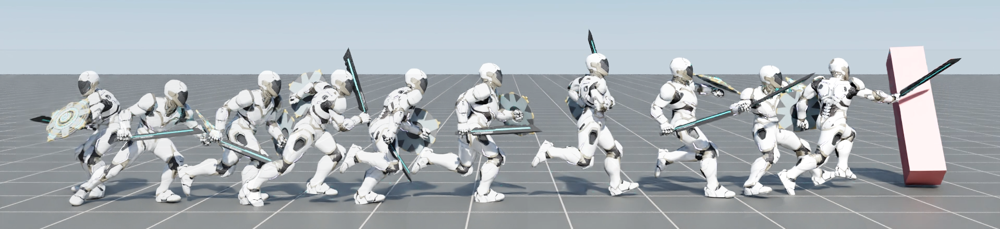

# Morph

Code accompanying the paper:
"Morph: A Motion-free Physics Optimization Framework for Human Motion Generation" \
(https://interestingzhuo.github.io/projects/morph/index.html) \



### Installation

Download Isaac Gym from the [website](https://developer.nvidia.com/isaac-gym), then
follow the installation instructions.

Once Isaac Gym is installed, install the external dependencies for this repo:

```
pip install -r requirements.txt
```


### Morph

#### Training

First, an Morph model can be trained to imitate a dataset of motions clips using the following command:
```
horovodrun -np 8 python ase/run.py --task HumanoidLocationSMPL --cfg_env ase/data/cfg/humanoid_smpl_location.yaml --cfg_train ase/data/cfg/train/rlg/smpl_humanoid_task.yaml --motion_file ase/data/motions/motions_amass_test_0.npy --headless
```
`--motion_file` can be used to specify a dataset of motion clips that the model should imitate. 
The task `HumanoidLocationSMPL` will train a model to imitate a dataset of motion clips.
Over the course of training, the latest checkpoint `Humanoid.pth` will be regularly saved to `output/`,
along with a Tensorboard log. `--headless` is used to disable visualizations. If you want to view the
simulation, simply remove this flag. To test a trained model, use the following command:
```
python ase/run.py --test --task HumanoidLocationSMPL --num_envs 16 --cfg_env ase/data/cfg/humanoid_smpl_location.yaml --cfg_train ase/data/cfg/train/rlg/smpl_humanoid_task.yaml --motion_file ase/data/motions/motions_amass_test_0.npy --checkpoint [path_to_ase_checkpoint]
```


### Motion Data

Motion clips are located in `ase/data/motions/`. Individual motion clips are stored as `.npy` files.  Motion clips can be visualized with the following command:
```
python ase/run.py --test --task HumanoidViewMotion --num_envs 2 --cfg_env ase/data/cfg/humanoid.yaml --cfg_train ase/data/cfg/train/rlg/smpl_humanoid.yaml --motion_file ase/data/motions/motions_amass_test_0.npy
```
`--motion_file` can be used to visualize a single motion clip `.npy`

If you want to load new motion clips to the character, you can take a look at an example script in `ase/poselib/load_motion.py`.
